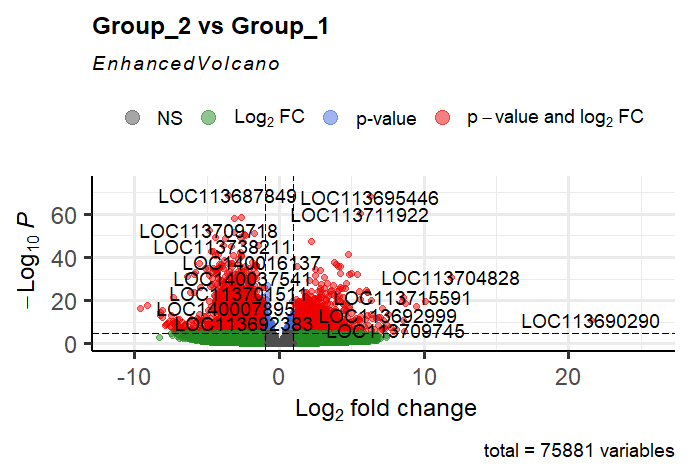
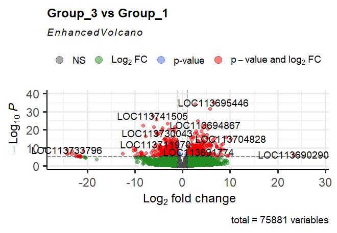

# Transcriptomics_Coffee-Rust
This is a brief guide on how to carry out the quality control, trimming, alignment, and differential expression analysis of RNAseq of coffee plants inoculated with the pathogen Hemileia vastatrix. 

## Step 1: Quality Control of Raw Data 
### Navigate to the folder that contains the raw ".fq.gz" files.  
```bash
cd /data2/lnoboa/roya_transcriptomics/data_cafe_roya/raw_data_roya
```
### Activate the conda environment. 
```bash
conda activate transcriptomics_env
```
### Run FastQC to assess the quality of the sequences.  
```bash
fastqc *.fq.gz -o /data2/lnoboa/roya_transcriptomics/fastqc_cafe_roya/fastqc_rawdata
```
### Run MultiQC in the same folder. 
```bash
multiqc .
```
[Check the report](multiqc_report_roya_raw_data.html)

## Step 2: Trimming 
###Run the Trimmomatic tool to remove low quality reads and adapters. 
```bash
TRIMMOMATIC=/home/jupyter-alumno7/.conda/envs/rnseq/bin/trimmomatic
ADAPTERS=/home/jupyter-alumno7/.conda/envs/rnseq/share/trimmomatic/adapters/TruSeq3-PE.fa
THREADS=4
INPUT_DIR=/data2/lnoboa/roya_transcriptomics/data_cafe_roya/raw_data_roya
OUTPUT_DIR=/data2/lnoboa/roya_transcriptomics/data_cafe_roya/data_trimmed

for f1 in $INPUT_DIR/*_1.fq.gz; do
    base=$(basename "$f1" _1.fq.gz)
    f2="$INPUT_DIR/${base}_2.fq.gz"
     
    $TRIMMOMATIC PE -threads $THREADS \
        "$f1" "$f2" \
        "$OUTPUT_DIR/${base}_1.trim.fq.gz" "$OUTPUT_DIR/${base}_1un.trim.fq.gz" \
        "$OUTPUT_DIR/${base}_2.trim.fq.gz" "$OUTPUT_DIR/${base}_2un.trim.fq.gz" \
        ILLUMINACLIP:$ADAPTERS:2:30:10 SLIDINGWINDOW:4:20 MINLEN:36
  done
```

## Step 3: Quality Control of the Trimmed Sequences 
### Navigate to the folder that contains the trimmed ".fq.gz" files.  
```bash
cd /data2/lnoboa/roya_transcriptomics/data_cafe_roya/data_trimmed
```
### Activate the conda environment. 
```bash
conda activate transcriptomics_env
```
### Run FastQC to assess the quality of the sequences.  
```bash
fastqc *.fq.gz -o /data2/lnoboa/roya_transcriptomics/fastqc_cafe_roya/fastqc_trimmed
```
### Run MultiQC in the same folder. 
```bash
multiqc .
```
[Check the report](multiqc_report_roya_trimmed.html)

## Step 4: Alignment to the Reference Genome 
### Create a folder for results. 
```bash
cd data2/lnoboa/roya_transcriptomics/
mkdir mapping_results
```
### Upload the genome index. 
[Reference genome](https://www.ncbi.nlm.nih.gov/datasets/genome/GCF_036785885.1/)
```bash
cd /data2/lnoboa/ref_genome_coffea
hisat2-build -p 4 GCF_036785885.1_Coffea_Arabica_ET-39_HiFi_genomic.fna coffea_index
```
### Mapping of sequences. 
#### Alignment of the trimmed sequences to the reference genome. 
```bash
cd /data2/lnoboa/roya_transcriptomics/data_cafe_roya/data_trimmed
for sample in *_1.trim.fq.gz; do
    base=$(basename $sample _1.trim.fq.gz)
    hisat2 -p 4 \
        -x /data2/lnoboa/ref_genome_coffea/coffea_index \
        -1 ${base}_1.trim.fq.gz \
        -2 ${base}_2.trim.fq.gz \
        -S /data2/lnoboa/mapping_results/${base}.sam
done
```
### Convert SAM to BAM. 
```bash
for f in *.sam; do
    base=$(basename "$f" .sam)
    samtools sort "$f" -o "${base}_sorted.bam"
```
## Step 5: Quantification of Mapped Reads. 
```bash
featureCounts -p -t exon -g gene_id   -a /data2/lnoboa/ref_genome_coffea/genomic.gtf   -o counts_matrix.txt /data2/lnoboa/roya_transcriptomics/mapping_results/*_sorted.bam
```

## Step 6: Differential Expression Analysis with DESeq2 in R
### Install and load the recquired packages. 
```bash
if (!requireNamespace("BiocManager", quietly = TRUE)) install.packages("BiocManager")
BiocManager::install(c("DESeq2", "EnhancedVolcano"))
install.packages(c("ggplot2", "pheatmap"))
library(DESeq2)
library(ggplot2)
library(EnhancedVolcano)
library(pheatmap)
```
### Set the working directory. 
```r
setwd("D:/lucianoboa/royatranscriptomics/analysis/featureCounts")
```
### Load the count matrix. 
```r
countData <- read.table("counts_matrix_complete_royatranscriptomics.txt", header=TRUE, row.names=1, sep="\t")
```
### Check the column names.
```r
colnames(countData)
```

```r
 [1] "Chr"                                                               
 [2] "Start"                                                             
 [3] "End"                                                               
 [4] "Strand"                                                            
 [5] "Length"                                                            
 [6] "X.data2.lnoboa.roya_transcriptomics.mapping_results.H10_sorted.bam"
 [7] "X.data2.lnoboa.roya_transcriptomics.mapping_results.H11_sorted.bam"
 [8] "X.data2.lnoboa.roya_transcriptomics.mapping_results.H12_sorted.bam"
 [9] "X.data2.lnoboa.roya_transcriptomics.mapping_results.H13_sorted.bam"
[10] "X.data2.lnoboa.roya_transcriptomics.mapping_results.H14_sorted.bam"
[11] "X.data2.lnoboa.roya_transcriptomics.mapping_results.H15_sorted.bam"
[12] "X.data2.lnoboa.roya_transcriptomics.mapping_results.H16_sorted.bam"
[13] "X.data2.lnoboa.roya_transcriptomics.mapping_results.H9_sorted.bam" 
[14] "X.data2.lnoboa.roya_transcriptomics.mapping_results.T1_sorted.bam" 
[15] "X.data2.lnoboa.roya_transcriptomics.mapping_results.T2_sorted.bam" 
[16] "X.data2.lnoboa.roya_transcriptomics.mapping_results.T3_sorted.bam" 
[17] "X.data2.lnoboa.roya_transcriptomics.mapping_results.T4_sorted.bam" 
[18] "X.data2.lnoboa.roya_transcriptomics.mapping_results.T5_sorted.bam" 
[19] "X.data2.lnoboa.roya_transcriptomics.mapping_results.T6_sorted.bam" 
[20] "X.data2.lnoboa.roya_transcriptomics.mapping_results.T7_sorted.bam" 
[21] "X.data2.lnoboa.roya_transcriptomics.mapping_results.T8_sorted.bam" 
```

### Select only the count columns (columns 6 to 21).
```r
countData <- countData[, 6:21]
```
### Check dimensions of the filtered count matrix.
```r
dim(countData)
```
```r
[1] 75881    16
```
### Rename columns with simpler sample names.
```r
colnames(countData) <- c("H10","H11","H12","H13","H14","H15","H16","H9",
                         "T1","T2","T3","T4","T5","T6","T7","T8")
```
### Define experimental conditions.
#### Eight samples H = 24 hours, Six samples T = 0 hours.
```r
condition <- factor(c(rep("H24", 8), rep("T0", 6)))
```
### Create colData with experimental metadata.
```r
colData <- data.frame(row.names = colnames(countData),
                      condition = condition)
```
### Assembly of the differential expression matrix.
```r
dds <- DESeqDataSetFromMatrix(countData = countData, 
                              colData = colData, 
                              design = ~ condition)

dds <- DESeq(dds)
res <- results(dds, contrast = c("condition", "H24", "T0"))
res <- res[order(res$padj), ]
head(res)
```
### Top differentially expressed genes (DEGs)
```r
head(res)
```

#### The following shows the top six genes sorted by adjusted p-value from the DESeq2 analysis (H24 vs T0):
```r
log2 fold change (MLE): condition H24 vs T0 
Wald test p-value: condition H24 vs T0 
DataFrame with 6 rows and 6 columns
              baseMean log2FoldChange     lfcSE      stat      pvalue        padj
             <numeric>      <numeric> <numeric> <numeric>   <numeric>   <numeric>
LOC113695446  2642.788        6.34457  0.329462   19.2573 1.22515e-82 5.04478e-78
LOC113711922  1553.615        5.64186  0.311725   18.0988 3.25437e-73 6.70026e-69
LOC113741897   381.172       -3.11981  0.183416  -17.0095 6.97968e-65 9.58007e-61
LOC113735746  1925.477       -1.66895  0.103200  -16.1720 7.94409e-59 8.17785e-55
LOC113694269   897.030        2.33362  0.159588   14.6228 2.00883e-48 1.65435e-44
LOC113716400  1896.846        4.69133  0.328411   14.2850 2.71582e-46 1.86382e-42
```
### DESeq2 Summary of Differential Expression (H24 vs T0)
```r
summary(res)
```
#### The summary below shows the overall statistics from the DESeq2 analysis:
```r
out of 47408 with nonzero total read count
adjusted p-value < 0.1
LFC > 0 (up)       : 7022, 15%
LFC < 0 (down)     : 7033, 15%
outliers [1]       : 0, 0%
low counts [2]     : 6634, 14%
(mean count < 2)
[1] see 'cooksCutoff' argument of ?results
[2] see 'independentFiltering' argument of ?results
```
###  Principal Component Analysis (PCA) of Samples
```r
rld <- rlog(dds, blind = TRUE)
x=plotPCA(rld, intgroup = "condition", pcsToUse = 1:2, ntop = 70000) +
  geom_text(aes(label = name), vjust = 1) +
  theme_minimal()
```


### Volcano Plot of Differentially Expressed Genes
```r
EnhancedVolcano(res,
                lab = rownames(res),
                x = "log2FoldChange",
                y = "pvalue",
                xlim = c(-35, 35))
```


### MA Plot of Differential Expression
```r
DESeq2::plotMA(res, alpha = 0.1,
               main = "Expression Differences: H24 vs T0",
               ylim = c(-30, 30))

```


### Most Differentially Expressed Genes Heatmap
```r
top_genes <- row.names(res)[1:20]
counts_top <- log2(counts(dds, normalized = TRUE)[top_genes,] + 1)
pheatmap(counts_top, annotation_col = colData)
```


## Step 7: Explore and organize the data. 

### Install and load the recquired packages. 
```r
if (!require("BiocManager", quietly = TRUE))
  install.packages("BiocManager")
BiocManager::install("edgeR")
BiocManager::install("limma")
library(limma)
library(edgeR)
```

### Set working directory.
```r
setwd("D:/lucianoboa/royatranscriptomics/analysis/featureCounts")
```

### Create a directory to store the analysis results.  
```r
outpath = "/lucianoboa/royatranscriptomics/analysis/results/"
dir.create(outpath, showWarnings=FALSE)
```

### Load the count matrix.
```r
readLines("counts_matrix_complete_royatranscriptomics.txt", n = 5)
counts <- read.table("counts_matrix_complete_royatranscriptomics.txt", 
                         header = TRUE, 
                         sep = "\t", 
                         comment.char = "#", 
                         check.names = FALSE)
```

### Remove annotation columns (Chr, Start, End, Strand, Length).
```r
counts <- counts_raw[, -(2:6)]
```

### Simplify and make the data more readable. 
```r
colnames(countData) <- c("H10","H11","H12","H13","H14","H15","H16","H9",
                         "T1","T2","T3","T4","T5","T6","T7","T8")
```

### Set Geneid as row names and remove the redundant column.
```r
rownames(counts) <- counts_raw$Geneid
counts <- counts[, -1]
```

### Preview the first rows of the matrix. 
```r
head(counts)
```

```r
              H10  H11  H12  H13  H14  H15  H16   H9   T1   T2   T3   T4   T5   T6   T7  T8
LOC113687214    0    0    0    0    0    0    0    0    0    0    0    0    0    0    0   0
LOC113696942   94  196   70  101  106  137  244   55   91   65   52  103   31   31   72  96
LOC113688401   10    0    0    0    0    0    0    0    0    0    0    0    0    0    0   0
LOC140003795 1667 1208 1623 1730 1354 1283 1562 1625 1088 1599 1864 1270 1247 1064 1195 981
LOC140008913  782  998  560  434  350 1080  909  620  645  466  468  665  706  470  662 505
LOC113687412   11    0    0    0    0    0   18   15   19    0   13    3   13   11    3  11
```

### Check the dimensions of the counts matrix
#### View the number of genes (rows) and samples (columns) included in the analysis.
```r
dim(counts)
```

```r
[1] 75881    13
```

### Check the column names of the counts matrix to verify the sample names
```r
col(names)
```

```r
[1] "/data2/lnoboa/roya_transcriptomics/mapping_results/H11_sorted.bam"
 [2] "/data2/lnoboa/roya_transcriptomics/mapping_results/H12_sorted.bam"
 [3] "/data2/lnoboa/roya_transcriptomics/mapping_results/H13_sorted.bam"
 [4] "/data2/lnoboa/roya_transcriptomics/mapping_results/H14_sorted.bam"
 [5] "/data2/lnoboa/roya_transcriptomics/mapping_results/H15_sorted.bam"
 [6] "/data2/lnoboa/roya_transcriptomics/mapping_results/H16_sorted.bam"
 [7] "/data2/lnoboa/roya_transcriptomics/mapping_results/H9_sorted.bam" 
 [8] "/data2/lnoboa/roya_transcriptomics/mapping_results/T1_sorted.bam" 
 [9] "/data2/lnoboa/roya_transcriptomics/mapping_results/T4_sorted.bam" 
[10] "/data2/lnoboa/roya_transcriptomics/mapping_results/T5_sorted.bam" 
[11] "/data2/lnoboa/roya_transcriptomics/mapping_results/T6_sorted.bam" 
[12] "/data2/lnoboa/roya_transcriptomics/mapping_results/T7_sorted.bam" 
[13] "/data2/lnoboa/roya_transcriptomics/mapping_results/T8_sorted.bam" HERE
```

## Step 8: Exploratory Data Analysis with EdgeR 

### Set working directory.
```r
setwd("D:/lucianoboa/royatranscriptomics/analysis/featureCounts")
```
### Extract the sample group by removing the last two characters (replicate indicator).
grp = sub("..$", "", colnames(counts))

### Create the DGEList object. 
dge = DGEList(counts = counts, group = grp)

### View the Multi-Dimensional Scaling (MDS). 
```r
plotMDS(dge)
```


### Data normalization through edgeR. 
```r
dgeNorm = calcNormFactors(dge)
dgeNorm$samples
```

```r
 group lib.size norm.factors
H10     H 31232620    1.0355758
H11     H 34742678    0.8907344
H12     H 29171648    1.0319465
H13     H 38199002    0.8062668
H14     H 32025344    0.8760510
H15     H 33154034    1.2281655
H16     H 37265378    0.9917321
H9        37752327    1.0569000
T1        36005488    1.0249644
T2        34097401    0.9670438
T3        38886281    1.0050208
T4        32715284    1.0499260
T5        28920829    1.0582333
T6        30113315    1.0083636
T7        31763529    1.0218342
T8        28244054    1.0130986
```

### Estimate the overall dispersion of the dataset. 
```r
dgeNorm$common.dispersion
```

```r
[1] 0.5996255
```

### Perform a differential expression analysis between two variables. 
```r
diff_exp <- exactTest(dge, pair = c("T0", "H24"))
diff_exp
```
```r
An object of class "DGEExact"
$table
                 logFC    logCPM     PValue
LOC113687214 0.0000000 -4.063864 1.00000000
LOC113696942 0.8709027  1.563622 0.06116436
LOC113688401 3.5003518 -3.663351 0.15983991
LOC140003795 0.2313062  5.396400 0.26304196
LOC140008913 0.2703101  4.270295 0.28083850
75876 more rows ...

$comparison
[1] "T0"  "H24"

$genes
NULL
```

### Check the number of genes and statistics columns. 
```r
dim(diff_exp)
```
```r
[1] 75881     3
```

### Preview the top differentially expressed genes sorted by significance.
```r
topTags(diff_exp)
```
```r
Comparison of groups:  H24-T0 
                 logFC   logCPM       PValue          FDR
LOC113695446  6.379382 6.358264 8.116179e-59 6.158638e-54
LOC113711922  5.675303 5.593649 2.053176e-53 7.789851e-49
LOC113716400  4.740248 5.892000 3.132200e-37 7.922483e-33
LOC113706933  4.077828 5.264267 1.359062e-36 2.578174e-32
LOC113694867  4.391010 6.089169 6.075053e-35 9.219622e-31
LOC113720646  3.896888 5.156499 4.210552e-34 5.325015e-30
LOC113692795  4.952827 5.372164 3.343495e-33 3.624396e-29
LOC140014808  5.449834 5.262370 5.680793e-32 5.388303e-28
LOC140013878 -3.404987 5.641357 4.631570e-31 3.904979e-27
LOC113714533 -3.083582 5.465033 4.525411e-30 3.433927e-26
```

### Check the number of top differentially expressed genes
```r
dim(topTags(diff_exp))
```
```r
[1] 10  4
```

### Extract all top differentially expressed genes. 
```r
deTab = topTags(diff_exp, n = Inf)$table
deTab[c(15,30),]
```
```r
              logFC   logCPM       PValue          FDR
LOC140037741 4.134671 4.507071 6.305664e-28 3.189867e-24
LOC140005275 6.240319 5.865138 1.839838e-24 4.653626e-21
```

### Identify significant differentially expressed genes. 
```r
deGenes = rownames(deTab)[deTab$FDR < 0.05 & abs(deTab$logFC) > 1]
```

### Separate induced and suppressed genes. 
```r
down=row.names(deTab)[deTab$logFC< -1]
over=row.names(deTab)[deTab$logFC> 1]
```

### Summary of differential expression.
```r
print(paste("diffentially expressed genes total:", length(deGenes)))
```
```r
[1] "diffentially expressed genes total: 6101"
```
```r
print(paste("number of induced genes:", length(over)))
```
```r
[1] "number of induced genes: 10747"
```
```r
print(paste("number of suppressed genes:", length(down)))
```
```r
[1] "number of suppressed genes: 7815"
```

### Visualize differential expression with a smear plot. 
```r
plotSmear(dge, de.tags=deGenes, ylab = "H24 vs T0")
```


### Install and load the recquired packages. 
```r
install.packages("gplots")
install.packages("RcolorBrewer")
library("gplots")
library("RColorBrewer")
```

### Normalization of counts. 
```r
normalized= cpm(counts)
normalized_differentials= normalized[deGenes,]
head(normalized_differentials)
```
```r
                   H10       H11       H12       H13       H14       H15       H16        H9        T1
LOC113695446 163.22678 151.91690 188.95059 199.14133 127.52400 118.32648  98.02665 208.33153 0.9443005
LOC113711922  86.89633 110.67080 121.55638  94.53127  94.11296  64.84882  78.16907  78.93553 2.0274687
LOC113716400  93.20384  99.24393  80.62623 149.06149 147.07102  57.82102  92.06937 150.90461 5.8324442
LOC113706933  85.26342  44.32589  85.59681  88.01277  54.51932  61.07854  65.79834  81.58437 5.3602940
LOC113694867  97.87844 122.75968 253.15676 147.49076  76.25211  86.14336 106.88205 119.75421 7.8043658
LOC113720646  46.87407  58.97646 115.55741  56.67687  72.09915  44.85125  59.89474  64.41987 5.1658792
                    T2       T3        T4       T5       T6       T7       T8
LOC113695446  1.231765 2.263009 0.7947356 2.143784 5.114017 1.763028 1.557850
LOC113711922  0.821177 3.394513 0.7947356 2.593287 3.187959 1.133375 1.097576
LOC113716400  6.980004 3.780254 4.0348114 3.042790 7.272530 1.637098 2.018124
LOC113706933  1.554371 8.409135 3.1789423 5.843539 4.416651 3.903848 2.336775
LOC113694867 10.030090 4.063130 4.2182119 7.676129 5.313264 1.920442 9.170072
LOC113720646  5.132356 5.837534 4.1570784 3.561447 2.125306 2.266751 8.107901
```

### Heatmap of normalized counts for differentially expressed genes.
```r
heatmap(normalized_differentials, Colv = NA)
```


### Barplot of the amount of reads per sample. 
```r
barplot(apply(normalizados_diferenciales,2,sum),las=2, cex.names = 1, col = (1:8))
```


### Principal component anaylisis of the gene expression after rust inoculation. 
```r
pca <- princomp(normalized_differentials[,c(1:8)])
plot(pca$loadings, col=as.factor(colnames(normalized_differentials[,c(1:8)])), pch=19, cex=2, main="PCA of Gene Expression After Rust Inoculation", ylim = c(-0.8,0.8))
text(pca$loadings, as.vector(colnames(normalized_differentials[,c(1:8)])), pos=3, cex=0.8)
```


### Volcano plot of differential expression. 
```r
with(deTab, plot(logFC, -log10(FDR), pch=20, cex=0.8, col="black", main="Before (T0) vs After (T24) Rust Inoculation", xlim=c(-8, 8), ylim=c(0,60)))
text(deTab[1:20,]$logFC,-log(deTab[1:20,]$FDR,10),labels=rownames(deTab[1:20,]),cex=0.7,pos=1)
with(subset(deTab, FDR<.01 & abs(logFC)>2), points(logFC, -log10(FDR), pch=20, cex=0.5, col="green"))
abline(v=2,lty=2, col="blue")
abline(v=-2,lty=2, col="blue")
legend("bottomright","Up_regulated",cex=1)
legend("bottomleft","Down_regulated",cex=1)
```


```r
diff_exp2 = exactTest(dgeNorm, dispersion = dgeNorm$common.dispersion, pair = c("H24", "T0" ))
deTab2 = topTags(diff_exp2, n=Inf)$table
WTover= head(rownames(deTab), 30)
ste12over= head(rownames(deTab2), 30)
setdiff(WTover, ste12over)
diff_exp
```
```r
An object of class "DGEExact"
$table
                 logFC    logCPM     PValue
LOC113687214 0.0000000 -4.063864 1.00000000
LOC113696942 0.8709027  1.563622 0.06116436
LOC113688401 3.5003518 -3.663351 0.15983991
LOC140003795 0.2313062  5.396400 0.26304196
LOC140008913 0.2703101  4.270295 0.28083850
75876 more rows ...

$comparison
[1] "T0"  "H24"

$genes
NULL
```

### Comparison of top induced genes between sampling times. 
```r
diff_exp2 = exactTest(dgeNorm, dispersion = dgeNorm$common.dispersion, pair = c("H24", "T0" ))
deTab2 = topTags(diff_exp2, n=Inf)$table
WTover= head(rownames(deTab), 30)
ste12over= head(rownames(deTab2), 30)
setdiff(WTover, ste12over)
```
```r
 [1] "LOC113695446" "LOC113711922" "LOC113716400" "LOC113706933" "LOC113694867" "LOC113720646"
 [7] "LOC113692795" "LOC140014808" "LOC140013878" "LOC113714533" "LOC113734025" "LOC113729988"
[13] "LOC113702309" "LOC140036768" "LOC140037741" "LOC113730387" "LOC113710329" "LOC140003932"
[19] "LOC113731519" "LOC113688069" "LOC113715392" "LOC113724950" "LOC113687849" "LOC113741897"
[25] "LOC113734586" "LOC113719255" "LOC113694269" "LOC140035076" "LOC140005275"
```

## Step 9: Comparison Between Groups. 

### Setup the libraries and the dataset. 
```r
library(DESeq2)
library(ggplot2)
library(EnhancedVolcano)
library(pheatmap)
setwd("D:/lucianoboa/royatranscriptomics/analysis/featureCounts")
getwd()
```

### Setup the count matrix and establish the data frames. 
```r
countData <- read.table("counts_matrix_complete_royatranscriptomics.txt", 
                        header=TRUE, row.names=1, sep="\t")

countData <- countData[, 6:21]

colnames(countData) <- c("H10","H11","H12","H13","H14","H15","H16","H9",
                         "T1","T2","T3","T4","T5","T6","T7","T8")
```

### Establish the groups you want to compare. 
```r
group <- rep(NA, ncol(countData))
names(group) <- colnames(countData)

group[c("T1","T2","T3","T4","T5","T6","T7","T8")] <- "Group_1"
group[c("H9","H11","H13","H14","H16")] <- "Group_2"
group[c("H10","H12","H15")] <- "Group_3"

group <- factor(group)
```
```r
> group
    H10     H11     H12     H13     H14     H15     H16      H9      T1      T2      T3      T4      T5 
Group_3 Group_2 Group_3 Group_2 Group_2 Group_3 Group_2 Group_2 Group_1 Group_1 Group_1 Group_1 Group_1 
     T6      T7      T8 
Group_1 Group_1 Group_1 
Levels: Group_1 Group_2 Group_3
```

### Setup colData with the groups data. 
```r
colData <- data.frame(row.names = colnames(countData),
                      group = group)
```

### Create a DESeq2 dataset object using the defined experimental groups. 
```r
dds <- DESeqDataSetFromMatrix(countData = countData, 
                              colData = colData, 
                              design = ~ group)

dds <- DESeq(dds)
```

### Perform pairwise comparisons of gene expression between Group_1, Group_2, and Group_3, and organize results by adjusted p-value for significance.
```r
res_G2vsG1 <- results(dds, contrast = c("group", "Group_2", "Group_1"))
res_G3vsG1 <- results(dds, contrast = c("group", "Group_3", "Group_1"))
res_G2vsG3 <- results(dds, contrast = c("group", "Group_2", "Group_3"))

res_G2vsG1 <- res_G2vsG1[order(res_G2vsG1$padj), ]
res_G3vsG1 <- res_G3vsG1[order(res_G3vsG1$padj), ]
res_G2vsG3 <- res_G2vsG3[order(res_G2vsG3$padj), ]
```

### PCA plot 
```r
rld <- rlog(dds, blind = TRUE)
plotPCA(rld, intgroup = "group") +
  geom_text(aes(label = name), vjust = 1) +
  theme_minimal()
```


### Enhaced Volcano plots for the comparison between groups. 

```r
EnhancedVolcano(res_G2vsG1,
                lab = rownames(res_G2vsG1),
                x = "log2FoldChange",
                y = "pvalue",
                title = "Group_2 vs Group_1")
```


```r
EnhancedVolcano(res_G3vsG1,
                lab = rownames(res_G3vsG1),
                x = "log2FoldChange",
                y = "pvalue",
                title = "Group_3 vs Group_1")
```


```r
EnhancedVolcano(res_G2vsG3,
                lab = rownames(res_G2vsG3),
                x = "log2FoldChange",
                y = "pvalue",
                title = "Group_2 vs Group_3")
```


### MA plots for the comparison between groups. 
```r
plotMA(res_G1vsG2, main = "Group_1 vs Group_2", ylim = c(-20, 20))
```


```r
plotMA(res_G1vsG3, main = "Group_1 vs Group_3", ylim = c(-30, 30))
```


```r
plotMA(res_G2vsG3, main = "Group_2 vs Group_3", ylim = c(-30, 30))
```


### Heatmap of the most variable genes. 
```r
top_genes <- row.names(res_G1vsG2)[1:20]  # puedes cambiar a res_G1vsG3, etc.
counts_top <- log2(counts(dds, normalized = TRUE)[top_genes,] + 1)

pheatmap(counts_top, 
         annotation_col = colData, 
         scale = "row",
         main = "Top 20 genes - Comparison Between Groups")
```


### Set the parameters for the Venn diagram. 
```r
# 1. Create DGEList
dge <- DGEList(counts = counts, group = group)
dge <- calcNormFactors(dge)

# 2. Design matrix (Group1 = reference/control)
design <- model.matrix(~0 + group)
colnames(design) <- levels(group)

# 3. Estimate dispersion
dge <- estimateDisp(dge, design)

# 4. Fit model
fit <- glmFit(dge, design)

# 5. Define contrasts: G2–G1, G3–G1, G2–G3
contrast_G2vsG1 <- makeContrasts(Group_2 - Group_1, levels=design)
contrast_G3vsG1 <- makeContrasts(Group_3 - Group_1, levels=design)
contrast_G2vsG3 <- makeContrasts(Group_2 - Group_3, levels=design)

lrt_G2vsG1 <- glmLRT(fit, contrast=contrast_G2vsG1)
lrt_G3vsG1 <- glmLRT(fit, contrast=contrast_G3vsG1)
lrt_G2vsG3 <- glmLRT(fit, contrast=contrast_G2vsG3)

# 6. Extract DE genes
DE_G2vsG1 <- topTags(lrt_G2vsG1, n=Inf)$table
DE_G3vsG1 <- topTags(lrt_G3vsG1, n=Inf)$table
DE_G2vsG3 <- topTags(lrt_G2vsG3, n=Inf)$table

# Define up/down sets
DE_G2vsG1_up   <- rownames(DE_G2vsG1[DE_G2vsG1$FDR < 0.05 & DE_G2vsG1$logFC > 1, ])
DE_G2vsG1_down <- rownames(DE_G2vsG1[DE_G2vsG1$FDR < 0.05 & DE_G2vsG1$logFC < -1, ])

DE_G3vsG1_up   <- rownames(DE_G3vsG1[DE_G3vsG1$FDR < 0.05 & DE_G3vsG1$logFC > 1, ])
DE_G3vsG1_down <- rownames(DE_G3vsG1[DE_G3vsG1$FDR < 0.05 & DE_G3vsG1$logFC < -1, ])

DE_G2vsG3_up   <- rownames(DE_G2vsG3[DE_G2vsG3$FDR < 0.05 & DE_G2vsG3$logFC > 1, ])
DE_G2vsG3_down <- rownames(DE_G2vsG3[DE_G2vsG3$FDR < 0.05 & DE_G2vsG3$logFC < -1, ])
```
#### Venn diagram of up-regulated genes. 
```r
venn.diagram(
  x = list(
    "Group 2 vs Group 1" = DE_G2vsG1_up,
    "Group 3 vs Group 1" = DE_G3vsG1_up,
    "Group 2 vs Group 3" = DE_G2vsG3_up
  ),
  filename = "Venn_upregulated.png",
  output = TRUE,
  imagetype = "png",
  height = 700, width = 700, resolution = 300,
  col = c("#ff3837", "#ff8383", "#ffdcdc"),
  fill = c(alpha("#ff3837",0.8), alpha("#ff8383",0.8), alpha("#ffdcdc",0.9)),
  lwd = 1,
  cex = 0.7,
  cat.cex = 0.5,
  cat.pos = c(-20, 15, 170),
  cat.dist = c(0.05, 0.05, 0.08),
  cat.col = c("#ff3837", "#ff8383", "#ffdcdc"),
  main = "Overlap of Upregulated Genes",
  main.cex = 0.8
)
```


#### Venn diagram of down-regulated genes. 
```r
venn.diagram(
  x = list(
    "Group2 vs Group1" = DE_G2vsG1_down,
    "Group3 vs Group1" = DE_G3vsG1_down,
    "Group2 vs Group3" = DE_G2vsG3_down
  ),
  filename = "Venn_downregulated.png",
  output = TRUE,
  imagetype = "png",
  height = 800, width = 800, resolution = 300,
  col = c("#3a50f4", "#8596fe", "#c8cdfc"),
  fill = c(alpha("#3a50f4",0.9), alpha("#8596fe",0.9), alpha("#c8cdfc",0.9)),
  lwd = 1,
  cex = 0.7,
  cat.cex = 0.5,
  cat.pos = c(-30, 20, 170),
  cat.col = c("#3a50f4", '#8596fe', '#c8cdfc'),
  cat.dist = c(0.08, 0.08, 0.08),
  main = "Overlap of Downregulated Genes",
  main.cex = 0.8
)
```


## Step 10: Comparison of gene expression between high and low rust severity

### Setup the libraries, and the dataset.
```r
library(DESeq2)
library(ggplot2)
library(EnhancedVolcano)
library(pheatmap)

setwd("D:/lucianoboa/royatranscriptomics/analysis/featureCounts")
getwd()
```

### Setup the count matrix and establish the data frames.
```r
countData <- read.table("counts_matrix_complete_royatranscriptomics.txt", 
                        header=TRUE, row.names=1, sep="\t")

# Select only count columns (columns 6 to 21 in your original file)
countData <- countData[, 6:21]

# Rename columns to simple names
colnames(countData) <- c("H10","H11","H12","H13","H14","H15","H16","H9",
                         "T1","T2","T3","T4","T5","T6","T7","T8")
```
### Establish the groups you want to compare. 
```r
group <- rep(NA, ncol(countData))
names(group) <- colnames(countData)

group[c("H13","H14","H15")] <- "High_Severity"
group[c("H9","H10","H11","H12","H16")] <- "Low_Severity"
group[c("T1","T2","T3","T4","T5","T6","T7","T8")] <- "Non_infected"

group <- factor(group)
```
### Setup colData with the groups data. 
```r
colData <- data.frame(row.names = colnames(countData),
                      group = group)
```

### Create a DESeq2 dataset object using the defined experimental groups. 
```r
dds <- DESeqDataSetFromMatrix(countData = countData, 
                              colData = colData, 
                              design = ~ group)
dds <- DESeq(dds)
```
### Create a DESeq2 dataset object using the defined experimental groups. 
```r
dds <- DESeqDataSetFromMatrix(countData = countData, 
                              colData = colData, 
                              design = ~ group)
dds <- DESeq(dds)
```

### Perform pairwise comparisons of gene expression between Group_1, Group_2, and Group_3, and organize results by adjusted p-value for significance.
```r
res_High_vs_Low <- results(dds, contrast = c("group", "High_Severity", "Low_Severity"))
res_High_vs_Non <- results(dds, contrast = c("group", "High_Severity", "Non_infected"))
res_Low_vs_Non  <- results(dds, contrast = c("group", "Low_Severity", "Non_infected"))

res_High_vs_Low <- res_High_vs_Low[order(res_High_vs_Low$padj), ]
res_High_vs_Non <- res_High_vs_Non[order(res_High_vs_Non$padj), ]
res_Low_vs_Non  <- res_Low_vs_Non[order(res_Low_vs_Non$padj), ]
```
### PCA plot 
```r
rld <- rlog(dds, blind = TRUE)
plotPCA(rld, intgroup = "group") +
  geom_text(aes(label = name), vjust = 1) +
  theme_minimal()
```


### Enhaced Volcano plots for the comparison between rust severity levels. 
```r
EnhancedVolcano(res_High_vs_Low,
                lab = rownames(res_High_vs_Low),
                x = "log2FoldChange",
                y = "pvalue",
                title = "High Severity vs Low Severity")
```


### MA plots for the comparison between rust severity levels. 
```r
plotMA(res_High_vs_Low, main = "High vs Low Severity", ylim = c(-30, 30))
```


### Heatmap of the most variable genes of the three groups. 
```r
top_genes <- row.names(res_High_vs_Low)[1:20]  # can change to other comparisons
counts_top <- log2(counts(dds, normalized = TRUE)[top_genes,] + 1)

pheatmap(counts_top, 
         annotation_col = colData, 
         scale = "row",
         main = "High vs Low vs Non-infected")
```


### Heatmap of the most variable genes of the high and low rust severity samples. 
```r
high_low_samples <- colnames(countData)[group %in% c("High_Severity", "Low_Severity")]

counts_top_subset <- counts_top[, high_low_samples]

colData_subset <- colData[high_low_samples, , drop = FALSE]

pheatmap(counts_top_subset, 
         annotation_col = colData_subset, 
         scale = "row",
         main = "High vs Low Rust Severity")
```

